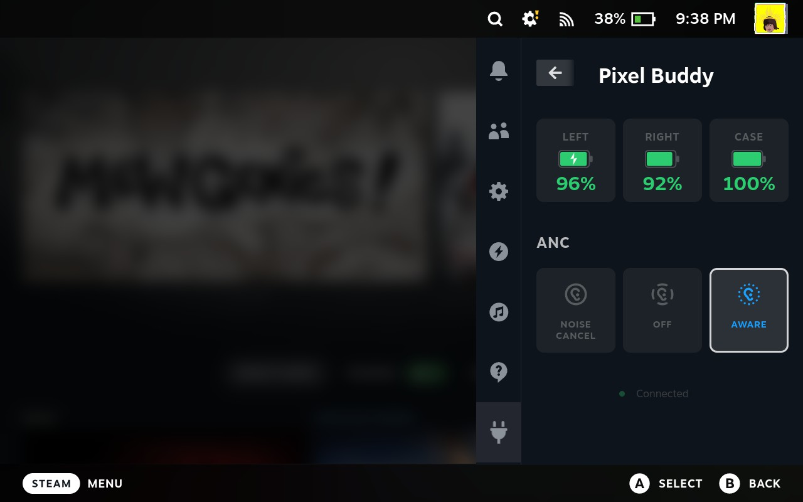

# Pixel Buddy

A Decky Loader plugin that lets you monitor battery and control ANC on your Google Pixel Buds Pro directly from Steam Deck.



## Features

- Battery levels for left bud, right bud, and case, with charging indicators
- ANC mode switching: Noise Cancellation / Off / Aware
- Auto-refresh every 5 seconds

## Install

1. Install [Decky Loader](https://decky.xyz) on your Steam Deck.
2. Open Decky from the Quick Access Menu and go to the **Store** tab.
3. Search for **Pixel Buddy** and install.
4. Pair your Pixel Buds Pro via SteamOS Bluetooth settings, then open the plugin from the Decky menu.

> **Supported devices:** Tested with Pixel Buds Pro (1st gen). Pixel Buds Pro 2 may work but is untested — please [open an issue](https://github.com/Phill544/Pixel-Buddy/issues) if you try it so the support list can be updated.

## Usage

Open the case near your Deck so the buds connect, then open the plugin. Battery levels appear automatically, and you can tap any of the three ANC cards to switch mode. The plugin polls the buds every 5 seconds.

## Troubleshooting

**The plugin says "Not Connected" even though my buds are connected to the Deck.**

1. Make sure the buds are out of the case and connected via SteamOS Bluetooth settings.
2. SSH into the Deck and run the bundled binary directly to see the raw error:
   ```bash
   ~/homebrew/plugins/pixel-buddy/bin/pbpctrl show battery
   ```
   If that command works but the plugin still shows "Not Connected", please [open an issue](https://github.com/Phill544/Pixel-Buddy/issues) with the output.

**The plugin doesn't appear in Decky.**

Restart the loader: `sudo systemctl restart plugin_loader`.

## Credits

- [pbpctrl](https://github.com/qzed/pbpctrl) by Maximilian Luz — the Rust CLI that talks to the Pixel Buds Pro over Bluetooth
- [Decky Loader](https://github.com/SteamDeckHomebrew/decky-loader) — the Steam Deck plugin framework

## License

Pixel Buddy is released under the [MIT License](LICENSE).

The bundled [`pbpctrl`](https://github.com/qzed/pbpctrl) binary is by Maximilian Luz, dual-licensed Apache-2.0 / MIT — redistributed here under MIT, with attribution in [`licenses/pbpctrl-LICENSE`](licenses/pbpctrl-LICENSE).
